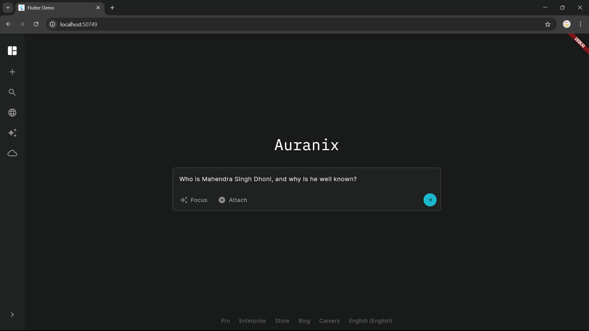
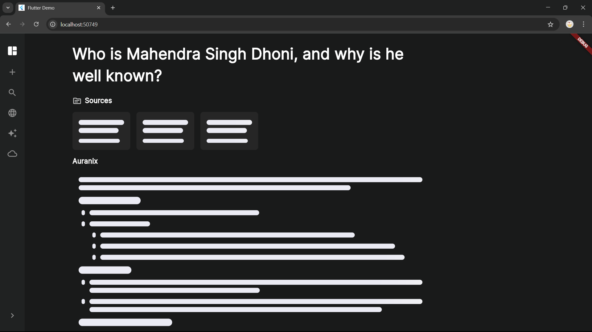
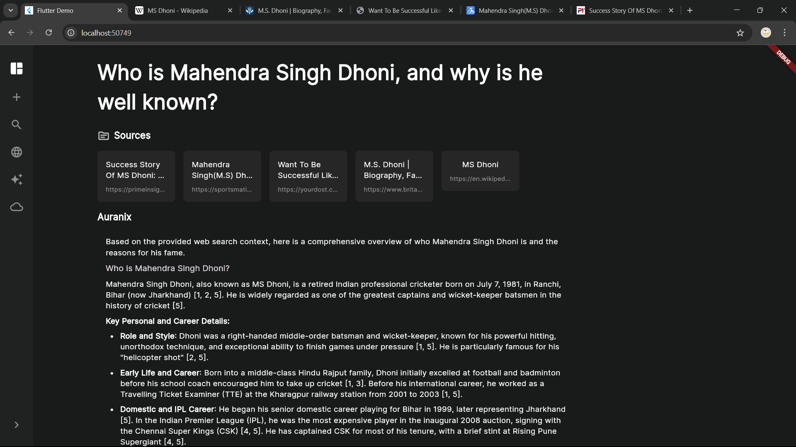
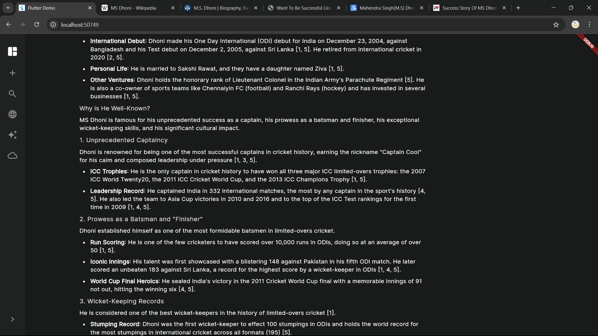
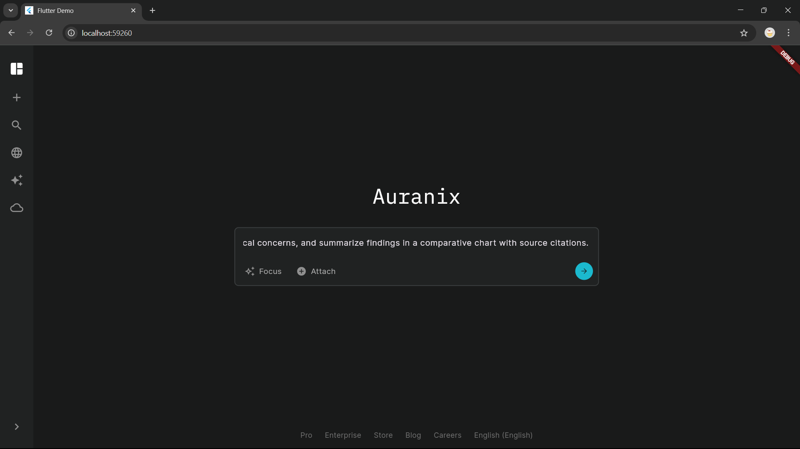
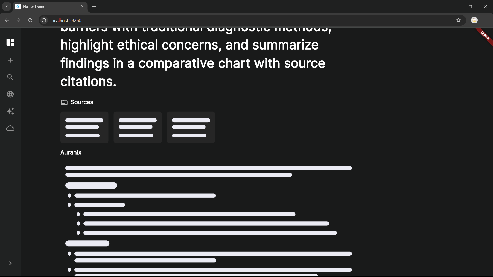

# Auranix 🤖🔍 — Intelligent, Source-Backed AI Query Assistant  

Developed **Auranix**, an AI-powered query assistant capable of processing long, complex natural language queries and delivering 100% authenticated, source-backed answers with deep contextual understanding.  
Built with a **Flutter** frontend and **FastAPI** backend, **Auranix** leverages **WebSockets** for real-time streaming responses, integrates **Tavily** and **Trafilatura** for intelligent web search and content extraction, and uses **Google Gemini** API (Generative AI) to generate fast, human-like, and trustworthy conversational search results — boosting productivity through seamless interaction.

---

## 🔎 Project Summary

- **Purpose:** Provide a fast, citation-aware AI assistant that searches the web, extracts high-quality content, ranks & summarizes it, and returns streamed answers to the user with source links.
- **Platforms:** Flutter (mobile/web) frontend, FastAPI backend (Python).
- **Key integrations:** Gemini API (generative responses), Tavily (web search), Trafilatura (clean HTML extraction), `sentence-transformers` (semantic similarity ranking).
- **Realtime:** WebSocket for low-latency streaming responses and updates.

---

## 📸 Screenshots

<p align="center">
  
  
</p>

<p align="center">
  
  
</p>

<p align="center">
  
  
</p>


---

## ⚙️ Features

- Real-time conversational interface (WebSocket streaming)
- Web search via **Tavily**, extract content using **Trafilatura**
- Semantic rank of candidate sources using Sentence-Transformers (e.g., `all-MiniLM-L6-v2`)
- Result generation via **Gemini API** (Generative AI)
- Source cards with clickable URLs
- Flutter frontend (mobile + web) with responsive UI

---

## 🛠️ Tech Stack & Libraries

**Backend**
- Python 3.10+
- FastAPI, Uvicorn
- WebSockets
- `tavily` (real-time web search API)
- `trafilatura` (HTML content extraction & cleanup)
- `sentence-transformers` (semantic similarity ranking on retrieved sources)
- `numpy` (cosine similarity)
- `python-dotenv` (environment variable management)


**AI / External Services**
- Google **Gemini** API (Generative AI)
- **Tavily** (web search)

**Frontend**
- Flutter (Dart) — cross-platform mobile & web app
- `flutter_markdown` — render markdown-formatted AI responses
- `url_launcher` — open external source links in browser
- `skeletonizer` — display skeleton loading states while fetching AI results
---

## 🚀 Quickstart — Local Development

### 1) Clone the repository
```bash
git clone https://github.com/abbasdx/auranix-ai.git
cd auranix-ai
```

### 2) Backend — Python & FastAPI
```bash
cd server             
python -m venv venv
# Windows
venv\Scripts\activate.ps1
# macOS / Linux
source venv/bin/activate

pip install -r requirements.txt
```

Create `.env` (in server folder):
```
GEMINI_API_KEY=your_gemini_api_key
TAVILY_API_KEY=your_tavily_api_key
```

Run backend:
```bash
fastapi dev main.py
```

- **HTTP endpoints:** `http://localhost:8000/`  
- **WebSocket endpoint (example):** `ws://localhost:8000/ws/chat`

---

### 3) Frontend — Flutter
```bash
flutter pub get
flutter run -d chrome   # or `flutter run` for device
```

---

## 🔧 Configuration & Environment Variables

Create a `.env` file in `server/`:

```env
# Required
GEMINI_API_KEY=your_gemini_api_key
TAVILY_API_KEY=your_tavily_api_key
```
---

## ♻️ Contributing

Thanks for wanting to contribute! Please:

1. Fork the repo
2. Create a branch: `git checkout -b feature/short-description`
3. Commit: `git commit -m "Add: short description"`
4. Push: `git push origin feature/short-description`
5. Open a Pull Request describing the change

Please run tests and update docs as needed.

---

## 📜 LICENSE

This project is open source under the **[MIT License](https://opensource.org/licenses/MIT)** — see the LICENSE file.  

Please **take permission from me before using** this project in commercial or high-scale applications.

---

## 🙏 Acknowledgements

- **Google Gemini & Google AI Platform** — for powering generative and conversational AI.
- **Tavily** — for accurate and relevant web search capabilities.
- **Trafilatura** — for robust HTML content extraction.
- **FastAPI** — for the high-performance backend framework.
- **Uvicorn** — for the lightning-fast ASGI server.
- **Sentence-Transformers** — for semantic similarity ranking of search results.
- **NumPy** — for efficient mathematical operations and cosine similarity calculations.
- **python-dotenv** — for secure environment variable management.
- **Flutter** — for building cross-platform web and mobile applications.
- **flutter_markdown** — for rendering AI responses with rich text formatting.
- **url_launcher** — for seamlessly opening external source links.
- **skeletonizer** — for smooth loading state placeholders in UI.
- **Starlette** — for WebSocket support and async capabilities in FastAPI.
- **Open Source Community** — for contributing tools, libraries, and knowledge that made this project possible.

---

## ✉️ Contact

If you want help, improvements, or collaboration — open an issue or reach out at: `abbasxansari@gmail.com`

---

**Enjoy building with Auranix — fast, source-aware, and human-like AI conversations.**
